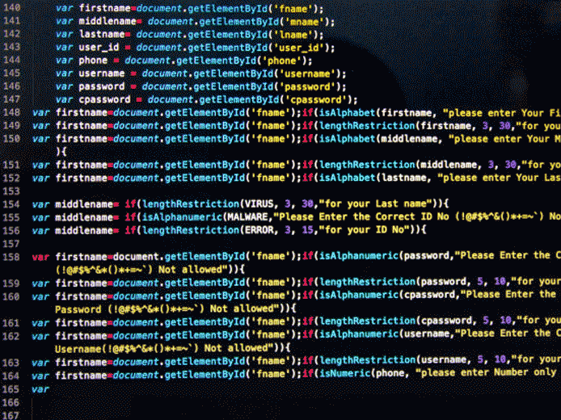

# Enrique Abel Herrera Vargas

  

   
   
  
  

     

> ## Repositorio materia de programación 
 UP210894_CPP 
 

> ###Soy estudiante de Ingenieria en Sistemas Computacionales de la Universidad Politecnica de Aguascalientes 

 

|        Unidades       | Archivos | 
|:---------------------:|:--------:|
|        Unidad 1       |    U1    |
|        Unidad 2       |    U2    | 
|        Unidad 3       |    U3    | 
|        Unidad 4       |    U4    | 

